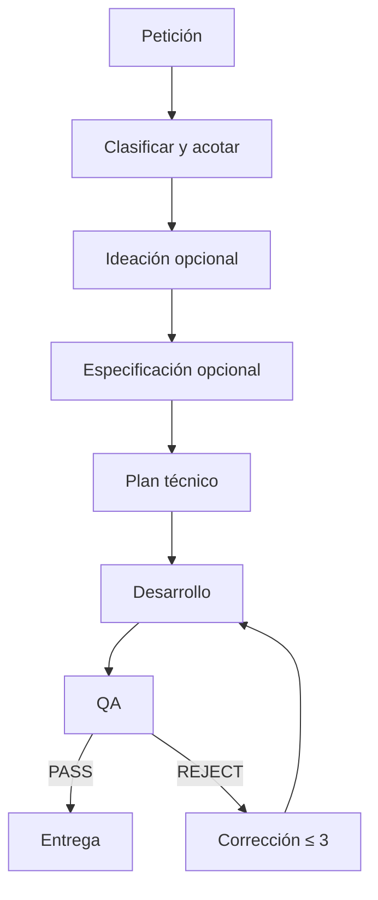
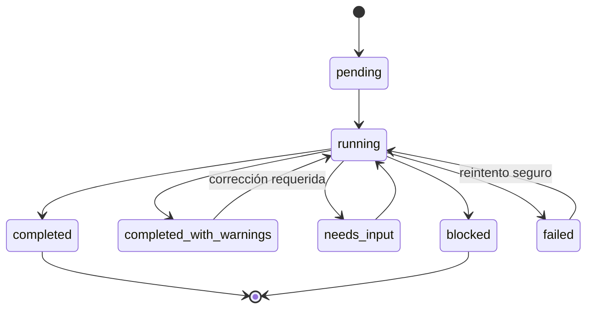

# Workflow del equipo frontend OMI

## Principio de funcionamiento

El agente principal de Codex es el orquestador. Los especialistas no forman una red libre: cada output vuelve al orquestador, se valida y se convierte en el input de la siguiente fase.

Las fases opcionales se omiten cuando la petición ya contiene esa decisión o cuando el usuario no ha solicitado implementación.

## Clasificación

| Intención | Señales habituales | Flujo mínimo |
|---|---|---|
| Idea | «dame ideas», «qué opciones hay» | Ideación |
| Diseño | «diseña», «define cómo se vería», sin pedir código | Ideación → Especificación |
| Implementación ambigua | «crea/rediseña» con resultado abierto | Ideación → Especificación → Plan → Desarrollo → QA |
| Implementación definida | requisitos y comportamiento concretos | Plan → Desarrollo → QA |
| Diagnóstico | «por qué falla», «encuentra el error», sin pedir arreglo | QA |
| Corrección | «arréglalo», «corrige el bug» | QA → Desarrollo → QA |
| Revisión | «revisa», «audita», «encuentra problemas» | QA |

El verbo del usuario determina hasta dónde llega el flujo. Una petición de análisis no autoriza cambios.

## Fase 0 — Descubrimiento

Antes de delegar:

1. Detectar raíz Git.
2. Leer `AGENTS.md` aplicables.
3. Revisar `package.json`, lockfile y estructura.
4. Revisar `git status`.
5. Identificar si existen cambios del usuario.
6. Definir objetivo y alcance preliminares.

El descubrimiento puede delegarse en lectura cuando el repositorio es grande, pero el orquestador conserva la decisión final.

## Fase 1 — Ideación

Se usa cuando la solución visual o UX todavía no está definida. Salida mínima:

- problema y objetivos;
- dirección recomendada;
- alternativas relevantes;
- secciones e interacciones;
- supuestos y riesgos;
- criterios preliminares.

Si el usuario pidió opciones, el flujo se detiene aquí. Si pidió implementar y no requiere aprobación explícita, la recomendación pasa a especificación.

## Fase 2 — Especificación UI

Convierte la idea en reglas concretas:

- estructura y componentes;
- design tokens;
- layout y responsive;
- estados e interacción;
- accesibilidad;
- contenido y assets;
- criterios de aceptación numerados.

No inicia desarrollo si faltan reglas fundamentales o existe una contradicción material.

## Fase 3 — Plan técnico

Se basa en evidencia del repositorio y produce:

- archivos a inspeccionar/modificar/crear;
- estrategia de reutilización;
- pasos por dependencia;
- límites técnicos;
- riesgos;
- comandos reales;
- tarea autocontenida para desarrollo.

## Fase 4 — Desarrollo

Un solo escritor implementa el alcance. Debe:

- preservar cambios existentes;
- aplicar el cambio mínimo completo;
- cubrir criterios;
- ejecutar validaciones;
- revisar diff;
- entregar evidencia a QA.

## Fase 5 — QA

QA verifica criterios y comportamiento de forma independiente. Resultados:

- `PASS`: todos los criterios obligatorios pasan y no hay blocker/high.
- `PASS_WITH_WARNINGS`: no hay blocker/high ni criterios obligatorios fallidos; quedan observaciones no bloqueantes.
- `REJECT`: existe blocker/high, criterio obligatorio fallido o evidencia insuficiente para aceptar de forma segura.

Por defecto, `AGENTS.md` exige `PASS` para declarar `completed`. El orquestador puede entregar `completed_with_warnings` con `PASS_WITH_WARNINGS` si las advertencias no contradicen la petición.

## Corrección tras rechazo

El handoff al desarrollador contiene:

- IDs de defects;
- severidad;
- criterios afectados;
- reproducción;
- evidencia;
- recomendación sin imponer una reescritura.

El desarrollador aplica la corrección mínima. QA vuelve a comprobar el defecto y el alcance relacionado.

Máximo: tres iteraciones automáticas. Después, `blocked` con:

- defecto persistente;
- intentos realizados;
- evidencia actual;
- decisión o recurso necesario.

## Paralelismo

Permitido:

- análisis independientes de solo lectura;
- exploración de áreas separadas;
- investigación documental que no dependa de otra salida.

No permitido:

- idea y especificación simultáneas;
- especificación y plan antes de aprobar la dirección;
- dos agentes editando el mismo repositorio;
- desarrollo y QA sobre una versión todavía cambiante.

## Estados y transiciones

## Formato de cierre

La entrega final contiene:

1. Resultado.
2. Agentes usados.
3. Archivos cambiados.
4. Validaciones y estados reales.
5. QA y número de iteraciones.
6. Warnings o elementos no probados.

